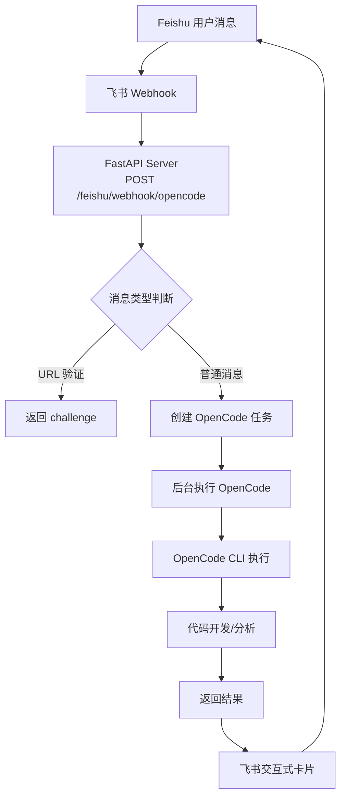
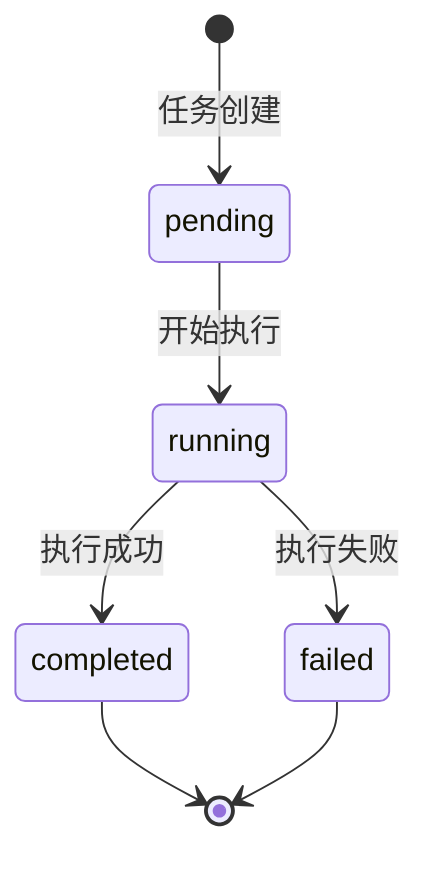

# AI Product Lab - Feishu & OpenCode Integration

一个基于 FastAPI 的 AI 编程代理服务，集成飞书 (Feishu) 和 OpenCode CLI，实现通过飞书消息触发 AI 驱动的代码开发任务。

## 🏗️ 系统架构



## ✨ 核心功能

- **🤖 OpenCode CLI 集成**: 执行 AI 驱动的代码开发任务
- **📱 Feishu 飞书集成**: 接收 webhook 消息并发送结果
- **📋 任务管理**: 创建、跟踪和监控 OpenCode 任务
- **🔄 实时进度**: 通过 Server-Sent Events (SSE) 流获取实时更新
- **💾 任务存储**: JSON 文件存储任务状态和历史记录
- **🔒 加密支持**: 支持飞书 AES-256-CBC 加密消息（可选）
- **🎨 交互式卡片**: 使用飞书交互式卡片展示任务进度和结果

## 📁 项目结构

```
ai-project/
├── app/                           # 核心应用代码
│   ├── main.py                    # FastAPI 入口点，路由注册
│   ├── opencode_integration.py    # OpenCode CLI 执行和任务生命周期管理
│   ├── feishu_client.py           # 飞书 API 客户端，消息和卡片发送
│   ├── feishu_crypto.py           # 飞书事件订阅加密/解密工具
│   ├── task_store.py              # JSON 文件基础的任务存储
│   ├── task_parser.py             # 飞书 webhook 负载解析
│   └── llm.py                     # 直接 LLM API 调用（DeepSeek）
├── data/                          # 数据存储
│   └── tasks/                     # 任务 JSON 文件存储目录
│       └── .gitkeep               # 保持目录的 Git 占位符
├── tests/                         # 测试文件
│   ├── test_api.py                # API 端点测试
│   ├── test_feishu_v2.py          # 飞书 v2 格式 webhook 测试
│   ├── test_opencode_integration.py  # OpenCode 集成测试
│   └── test_task_parser.py        # 任务解析测试
├── infra/                         # 基础设施配置
│   └── docker-compose.yml         # Docker Compose 配置（可选）
├── docs/                          # 文档目录
├── scripts/                       # 工具脚本目录
├── .env.example                   # 环境变量示例
├── .gitignore                     # Git 忽略规则
├── requirements.txt               # Python 依赖
├── requirements.lock.txt          # 依赖锁定文件
└── README.md                      # 本文档
```

## 📄 核心文件说明

| 文件 | 功能描述 | 关键类/函数 |
|------|----------|-------------|
| `app/main.py` | FastAPI 应用入口，注册所有路由 | `feishu_webhook_opencode()` - 处理飞书 webhook |
| `app/opencode_integration.py` | OpenCode 任务管理 | `OpenCodeManager` - 任务管理类<br/>`OpenCodeTask` - 任务数据类 |
| `app/feishu_client.py` | 飞书 API 客户端 | `FeishuClient` - API 客户端类<br/>`build_*_card()` - 卡片构建函数 |
| `app/feishu_crypto.py` | 飞书加密/解密 | `FeishuEncryptor` - 加解密类<br/>`decrypt_feishu_payload()` - 负载解密函数 |
| `app/task_store.py` | 任务持久化存储 | `save_task()`, `list_tasks()`, `get_task()`, `update_task()` |
| `app/task_parser.py` | 消息解析 | `extract_text_from_feishu_payload()` - 提取消息文本 |
| `app/llm.py` | LLM 接口 | `ask_deepseek_for_design_advice()` - DeepSeek API 调用 |

## 🔧 环境变量配置

复制 `.env.example` 为 `.env` 并配置以下变量：

```bash
# =========================
# 应用基础配置
# =========================
APP_ENV=dev                          # 环境：dev/prod
APP_HOST=0.0.0.0                     # 监听地址
APP_PORT=8000                        # 监听端口
LOG_LEVEL=INFO                       # 日志级别

# =========================
# 飞书配置（必需）
# =========================
FEISHU_APP_ID=cli_xxxxxxxxxxxxxxxx   # 飞书应用 ID
FEISHU_APP_SECRET=xxxxxxxxxxxxxxxx   # 飞书应用密钥
FEISHU_ENCRYPT_KEY=z8V8Qc6B3NqXjwKpP5rL9sT2uV1yW4x7A0D3F6H9K2M  # 飞书加密密钥（43字符）
FEISHU_VERIFICATION_TOKEN=z3V8Qc6B3NqXjaKpP5rL9sT2uV1yW4x7A0D4F6H9K2M  # 验证令牌
FEISHU_DEFAULT_CHAT_ID=oc_xxxxxxxxxxxxxxxxxxxxxxxx  # 默认聊天 ID（可选）

# =========================
# LLM API 密钥（OpenCode 使用）
# =========================
OPENAI_API_KEY=sk-xxxxxxxxxxxxxxxx   # OpenAI API 密钥（可选）
ANTHROPIC_API_KEY=xxxxxxxxxxxxxxxx   # Anthropic API 密钥（可选）
GEMINI_API_KEY=xxxxxxxxxxxxxxxx      # Gemini API 密钥（可选）
OPENROUTER_API_KEY=xxxxxxxxxxxxxxxx  # OpenRouter API 密钥（可选）

# =========================
# DeepSeek 配置（备用 LLM）
# =========================
DEEPSEEK_API_KEY=sk-xxxxxxxxxxxxxxxx # DeepSeek API 密钥
DEEPSEEK_BASE_URL=https://api.deepseek.com  # DeepSeek API 地址
DEEPSEEK_MODEL=deepseek-chat         # DeepSeek 模型

# =========================
# 隧道配置（生产环境需要）
# =========================
NGROK_AUTHTOKEN=xxxxxxxxxxxxxxxx     # ngrok v3 认证令牌
```

## 🚀 快速部署指南

### 步骤 1: 准备工作

1. **安装 Python 3.11+** 和虚拟环境工具
2. **安装 OpenCode CLI**:
   ```bash
   # 通过 npm 安装
   npm install -g opencode
   
   # 或通过其他包管理器
   # 确保 opencode 命令在 PATH 中
   which opencode
   ```
3. **克隆项目**:
   ```bash
   git clone <repository-url>
   cd ai-project
   ```

### 步骤 2: 安装 Python 依赖

```bash
# 创建虚拟环境
python -m venv .venv

# 激活虚拟环境
source .venv/bin/activate  # Linux/Mac
# 或
.venv\Scripts\activate     # Windows

# 安装依赖
pip install -r requirements.txt
```

### 步骤 3: 配置环境变量

```bash
# 复制环境变量模板
cp .env.example .env

# 编辑 .env 文件，填入你的配置
# 特别注意：FEISHU_APP_ID, FEISHU_APP_SECRET 必须填写
# 飞书控制台中获取：https://open.feishu.cn/app
```

### 步骤 4: 启动本地服务器

```bash
# 开发模式（带热重载）
uvicorn app.main:app --host 0.0.0.0 --port 8000 --reload

# 生产模式
uvicorn app.main:app --host 0.0.0.0 --port 8000 --workers 4
```

### 步骤 5: 设置公网隧道（用于飞书 webhook）

飞书需要公网可访问的 URL。选择以下方案之一：

#### 选项 A: serveo.net（快速测试）

```bash
# 启动 SSH 隧道
ssh -o StrictHostKeyChecking=no -R 80:localhost:8000 serveo.net

# 你会获得类似这样的 URL:
# https://xxxxxxxxxxxx.serveousercontent.com
```

#### 选项 B: ngrok（推荐生产）

```bash
# 1. 注册 ngrok 获取 authtoken: https://ngrok.com
# 2. 启动 ngrok
ngrok http 8000 --region ap  # 亚太地区

# 你会获得类似这样的 URL:
# https://xxxx-xx-xxx-xxx-xxx.ngrok-free.app
```

#### 选项 C: Cloudflare Tunnel（最稳定）

参考 [TUNNEL_SETUP.md](./TUNNEL_SETUP.md) 获取详细说明。

### 步骤 6: 配置飞书应用

1. **登录飞书开发者控制台**: https://open.feishu.cn/app
2. **选择你的应用**（或创建新应用）
3. **事件订阅** → **请求地址配置**:
   - URL: `https://你的隧道域名/feishu/webhook/opencode`
   - 验证令牌: 使用 `.env` 中的 `FEISHU_VERIFICATION_TOKEN`
   - 加密密钥: 使用 `.env` 中的 `FEISHU_ENCRYPT_KEY`
   - **重要**: 初始测试时**禁用加密**（"启用加密"设为 OFF）
4. **订阅事件**:
   - 添加 `im.message.receive_v1`（接收消息）
5. **权限管理**:
   - 启用 `im:message`（发送和接收消息）
   - 启用 `im:message:send_as_bot`（以机器人身份发送消息）
6. **保存并发布应用**

详细步骤参考 [FEISHU_SETUP.md](./FEISHU_SETUP.md)。

### 步骤 7: 测试系统

#### 测试 1: URL 验证（确保 webhook 连通）

```bash
curl -X POST https://你的隧道域名/feishu/webhook/opencode \
  -H "Content-Type: application/json" \
  -d '{"token": "你的验证令牌", "challenge": "test123", "type": "url_verification"}'

# 期望返回: {"challenge":"test123"}
```

#### 测试 2: 直接创建 OpenCode 任务

```bash
curl -X POST http://localhost:8000/opencode/tasks \
  -H "Content-Type: application/json" \
  -d '{"message": "请分析当前目录结构"}'
```

#### 测试 3: 通过飞书发送消息

在飞书中 @你的机器人，发送消息如：
```
@我的个人助手 请你访问一下 workspace/ai-project 目录
```

## 📡 API 端点

### OpenCode 任务管理

| 方法 | 端点 | 描述 | 请求体示例 |
|------|------|------|------------|
| POST | `/opencode/tasks` | 创建新任务 | `{"message": "任务描述", "feishu_chat_id": "可选"}` |
| GET | `/opencode/tasks` | 列出所有任务 | - |
| GET | `/opencode/tasks/{task_id}` | 获取任务详情 | - |
| GET | `/opencode/tasks/{task_id}/stream` | SSE 流获取实时进度 | - |
| POST | `/opencode/tasks/{task_id}/abort` | 中止运行中的任务 | - |

### Feishu 集成

| 方法 | 端点 | 描述 | 适用场景 |
|------|------|------|----------|
| POST | `/feishu/webhook` | 原始 webhook（DeepSeek LLM） | 兼容旧版本 |
| POST | `/feishu/webhook/opencode` | 新 webhook（OpenCode Agent） | 推荐使用 |

### 系统状态

| 方法 | 端点 | 描述 |
|------|------|------|
| GET | `/` | 根端点状态 |
| GET | `/health` | 健康检查 |
| GET | `/config-check` | 配置检查 |
| GET | `/feishu/config-check` | 飞书配置检查 |

## 🔄 任务状态流



## 🧪 测试

运行测试套件：

```bash
# 运行所有测试
pytest

# 运行特定测试文件
pytest tests/test_api.py
pytest tests/test_feishu_v2.py
pytest tests/test_opencode_integration.py

# 带详细输出
pytest -v
```

## 🔍 故障排除

### 1. 飞书 URL 验证失败 "Challenge code没有返回"

**可能原因**:
- 加密密钥不匹配
- 隧道 URL 不可访问
- 服务器响应超时（>3秒）

**解决方案**:
1. 检查飞书控制台加密密钥与 `.env` 是否一致
2. **暂时禁用飞书控制台的加密功能**
3. 测试隧道连通性：`curl https://你的隧道域名/health`
4. 检查服务器日志：`tail -f logs/server_final.log`

### 2. OpenCode 命令未找到

**解决方案**:
```bash
# 检查 opencode 是否安装
which opencode

# 安装 opencode
npm install -g opencode

# 或使用其他安装方法
```

### 3. 响应时间超过 3 秒

**解决方案**:
1. 使用 ngrok 替代 serveo.net（更低延迟）
2. 优化服务器代码（已优化）
3. 检查网络连接

### 4. 飞书消息无法触发任务

**检查步骤**:
1. 确认飞书应用已发布
2. 确认权限已开通
3. 检查服务器日志中的 webhook 接收情况
4. 确认事件订阅配置正确

更多故障排除参考 [FEISHU_SETUP.md#troubleshooting](./FEISHU_SETUP.md#troubleshooting)。

## 📊 监控与日志

### 日志文件
- `logs/server_final.log` - 服务器主日志
- `logs/serveo.log` - serveo.net 隧道日志
- `logs/ngrok.log` - ngrok 隧道日志

### 监控命令
```bash
# 实时查看服务器日志
tail -f logs/server_final.log

# 查看最近错误
grep -i error logs/server_final.log | tail -20

# 检查任务存储
ls -la data/tasks/*.json | wc -l
```

## 🚢 生产部署建议

1. **使用可靠的隧道服务**: ngrok 付费版或 Cloudflare Tunnel
2. **启用飞书加密**: 解决 `feishu_crypto.py` 中的解密问题后启用
3. **添加身份验证**: 为 API 端点添加 API 密钥认证
4. **设置监控告警**: 监控响应时间和错误率
5. **使用进程管理**: 使用 systemd 或 supervisor 管理 uvicorn 进程
6. **定期备份任务数据**: 备份 `data/tasks/` 目录

## 📚 相关文档

- [AGENTS.md](./AGENTS.md) - 项目架构和设计文档
- [FEISHU_SETUP.md](./FEISHU_SETUP.md) - 飞书详细配置指南
- [TUNNEL_SETUP.md](./TUNNEL_SETUP.md) - 隧道方案对比和设置
- [SUMMARY.md](./SUMMARY.md) - 项目状态总结

## 📄 许可证

MIT License

## 🙏 致谢

- [OpenCode](https://opencode.ai/) - AI 驱动的代码开发工具
- [Feishu Open Platform](https://open.feishu.cn/) - 飞书开放平台
- [FastAPI](https://fastapi.tiangolo.com/) - 现代 Python Web 框架

---

**💡 提示**: 系统已通过端到端测试验证，可正常接收飞书消息并执行 OpenCode 任务。首次部署建议禁用飞书加密功能以简化配置。